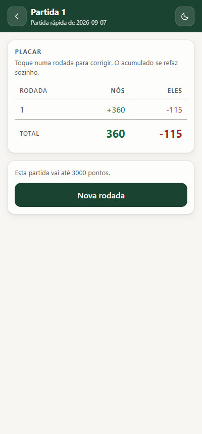
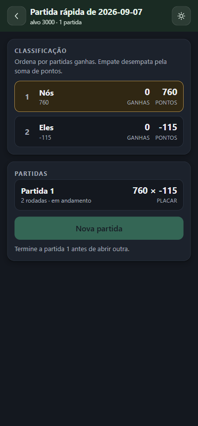

# Placar de Buraco

Contador de pontos de **buraco / canastra** para jogos presenciais. Funciona no navegador do celular,
instala na tela de início e roda offline. Sem conta, sem servidor, sem anúncio.

| Partida (tema claro) | Classificação da noite (tema escuro) |
|---|---|
|  |  |

## O que faz

Três níveis de acumulado, um dentro do outro:

```
Torneio (a noite)      -> partidas ganhas + soma de pontos
  Partida (até 3000)   -> acumulado por dupla
    Rodada (uma mão)   -> total da rodada por dupla
```

- **Folha de papel na tela**: uma linha por rodada, acumulado no rodapé, com sinal.
- **Correção retroativa**: toque numa rodada passada, corrija, e todo o placar abaixo se refaz sozinho.
  Nenhum total é armazenado — os três níveis são função pura da árvore de rodadas.
- **Teclado de cartas**: toque no rank para somar, na bolinha para tirar. Quem preferir somar de cabeça
  usa a aba "Digitar o total".
- **Duas métricas de torneio** ao mesmo tempo: partidas ganhas (primária) e soma de pontos (desempate).
- Temas claro e escuro, com a escolha guardada no navegador.

## Pontuação implementada

| Item | Pontos |
|---|---|
| 3, 4, 5, 6, 7 | 5 cada |
| 8, 9, 10, J, Q, K | 10 cada |
| Ás | 15 cada |
| Curinga (o `2`, ou o joker impresso) | 10 cada |
| Canastra limpa | 200 |
| Canastra suja | 100 |
| Ás ao Rei (13 cartas) | 500 |
| Ás ao Ás (14 cartas) | 1000 |
| Batida | +100 |
| Não pegou o morto | −100 |
| Cartas que sobraram na mão | subtraem o próprio valor |

Total da rodada = baixadas + canastras + batida − penalidade do morto − cartas na mão. **Pode ser
negativo**, e então o acumulado cai entre rodadas.

A partida encerra **ao fim da rodada** em que alguma dupla atinge o alvo — nunca no instante em que
cruza, porque a penalidade do morto e as cartas na mão podem derrubar quem já tinha passado de 3000.
Empate exato no topo vai para rodada de desempate.

## Como rodar

```
npm install
npm run dev        # servidor de desenvolvimento
npm run build      # typecheck + bundle + service worker em dist/
npm run preview    # serve o dist/ para conferir o build de produção
npm test           # 46 testes do motor de pontuação
npm run check      # typecheck + testes
npm run icones     # regera os ícones PNG do PWA
```

## Arquitetura

- **Vite + React + TypeScript**, SPA estática. Zero backend, zero função serverless.
- `src/engine/` é o motor: TypeScript puro, sem UI, sem I/O, sem estado. 46 testes.
- `src/telas/` e `src/componentes/` são a interface. Estado em `localStorage`.
- Ícones do PWA gerados por `scripts/gerar-icones.mjs`, que escreve o PNG na mão com o `zlib` do Node —
  três imagens não justificam a dependência do `sharp`.

Build de produção: 66,4 KB gzip de JavaScript, 2,20 KB de CSS.

Notas de arquitetura e decisões estão em [`DECISOES.md`](DECISOES.md); estado, regras e gotchas
operacionais em [`MEMORIA.md`](MEMORIA.md).

## Próximo passo

**Câmera assistida.** A ideia original é apontar a câmera para as cartas na mesa — sem tirar foto, com o
frame processado em memória e descartado — e o app **propor** a pontuação da rodada para os jogadores
validarem na tela.

A câmera entra como acelerador de digitação, nunca como fonte da verdade: o placar do buraco não é função
das cartas visíveis, porque depende de quem bateu, de quem pegou o morto e das cartas que sobraram na mão
(informação privada até o fim da rodada). O raciocínio completo está em `DECISOES.md`.

Detalhe técnico que simplifica: para pontuar, **o naipe é irrelevante**. O valor depende só do rank e de
ser curinga — então o modelo de visão precisa de 14 classes, não 52.

## Licença

A definir. Se o F2 adotar um dos modelos YOLO prontos (Ultralytics, AGPL-3.0), o projeto herda a
obrigação de código aberto — que é o motivo de este repositório já ser público.
